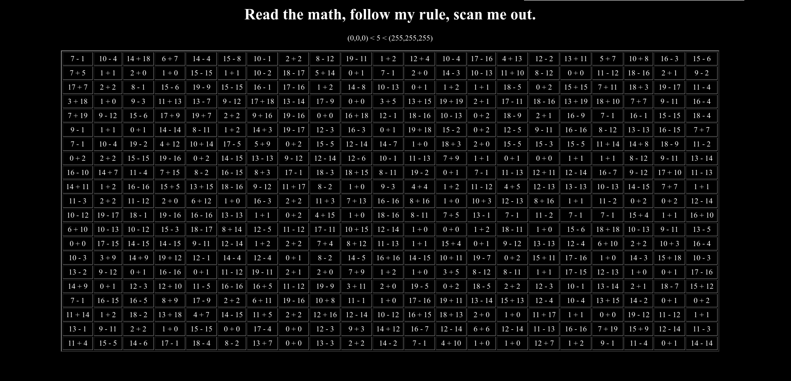
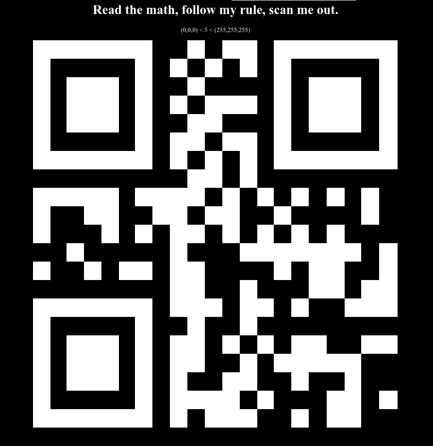

https://www.potatopla.net/crypto/challenges/11/

> Read the math, follow my rule, scan me out.

> (0,0,0) < 5 < (255,255,255)

The `scan me out` portion tipped me off quickly. That combined with the 
white (`(255,255,255)`) and black (`(0,0,0)`) RGB values led me to QR codes.

From there if we look at the grid of math operations we see numbers `< 5` and
`> 5` which confirms the second hint. So basically we need to evaluate these
expressions and update the grid with the corresponding color.

I ended up using this code (requires jQuery) to automate the process:

```
$("table").attr("border", "0");
$("table").attr("cellspacing", "0");
$("td").each(function() {
    $this = $(this);
    text = $this[0].innerHTML;
    value = eval(text);
    if (value < 5) {
        $this.css("background-color", "rgb(0,0,0)");
        $this.css("color", "rgb(0,0,0)");
    } else if (value > 5) {
        $this.css("background-color", "rgb(255,255,255)");
        $this.css("color", "rgb(255,255,255)");
    } else {
        console.log("Error!");
    }
});
```

Before:



After:



Finally if we scan the QR code (e.g. with a phone) we get a URL to append to
the challenge's URL. After appending we're sent to a page containing the flag.
